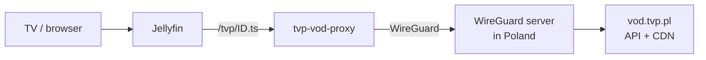
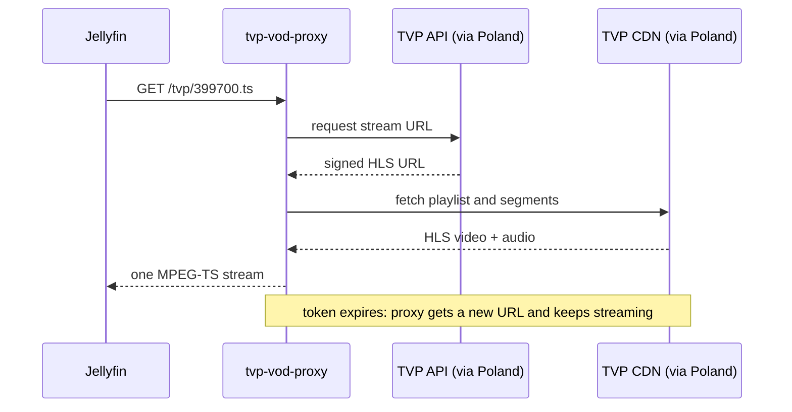

# tvp-vod-proxy-rs

[](https://github.com/mkowalski/tvp-vod-proxy-rs/actions/workflows/ci.yml)

Watch and record the free live channels of Polish public TV (TVP) in
[Jellyfin](https://jellyfin.org) or any IPTV client from outside Poland.

TVP streams its channels for free on [vod.tvp.pl](https://vod.tvp.pl), but only
to Polish IP addresses, and the stream URLs are short-lived signed tokens. This
proxy resolves those URLs through a WireGuard tunnel to a server in Poland and
serves each channel at a **stable URL as one continuous MPEG-TS stream**
(one video variant + the default Polish audio), which IPTV tuners and DVRs
handle well.

Only the proxy's traffic goes through Poland. The tunnel lives inside the
Docker Compose stack's network namespace; the host and every other container
keep their normal route.

## How it works



Only the proxy container uses the tunnel. The host and other containers keep
their normal route.



Per request for `/tvp/<id>.ts`:

1. The proxy asks TVP's API for the channel's current HLS URL (works only from
   a Polish IP, hence the tunnel).
2. It reads the master playlist and selects the highest video variant (or the
   highest under `MAX_BITRATE`, if set), plus the default audio rendition.
   DRM-protected channels are rejected with HTTP 415.
3. It writes a one-variant master playlist and runs `ffmpeg -c copy` on it,
   streaming MPEG-TS to the client. Reading video and audio as **one** HLS
   input keeps them on a single timeline (separate inputs drift out of A/V
   sync).
4. If ffmpeg stops (e.g. the signed token expires), the proxy resolves a fresh
   URL and continues on the same HTTP response, so long recordings survive
   token rotation. When the client disconnects, ffmpeg is killed.

No transcoding happens in the proxy; CPU use is negligible.

## Why MPEG-TS and not just the HLS URL?

TVP's streams are HLS masters with several video variants and a separate audio
rendition, in fMP4 segments. Jellyfin's DVR records Live TV with a fixed ffmpeg
command without `-map`, which on such sources can drop the video or pick the
wrong audio ([jellyfin#18234](https://github.com/jellyfin/jellyfin/issues/18234)).
A single pre-muxed MPEG-TS stream with exactly one video and one audio track
avoids that, and the URL never changes, so it can go into a static M3U.

## Requirements

- Docker with Compose v2.
- A WireGuard server **in Poland** you control (home router, VPS, …) and a peer
  configured for this stack.

## Setup

```sh
git clone https://github.com/mkowalski/tvp-vod-proxy-rs.git
cd tvp-vod-proxy-rs

# 1. WireGuard client config
mkdir -p wireguard/wg_confs
( umask 077; wg genkey | tee wireguard/privatekey | wg pubkey > wireguard/publickey )
cp wireguard/wg0.conf.example wireguard/wg_confs/wg0.conf
chmod 600 wireguard/wg_confs/wg0.conf
#   - put the private key into wg0.conf
#   - add wireguard/publickey as a peer on your server in Poland
#   - fill in Address, the server's PublicKey and Endpoint

# 2. Start (pulls ghcr.io/mkowalski/tvp-vod-proxy-rs)
docker compose up -d
docker compose ps          # tvp-pl-wg must become "healthy" (exit country = PL)

# 3. Test
curl -s -o /dev/null -w '%{http_code}\n' --max-time 10 http://localhost:38099/tvp/399700.ts
```

Images are published for `linux/amd64` and `linux/arm64` as
`ghcr.io/mkowalski/tvp-vod-proxy-rs:<version>` and `:latest`.

**Pin a version rather than `:latest`.** Restarting the proxy cuts every
stream going through it, including DVR recordings in progress, and Jellyfin
does not reconnect. The sample compose pins a version and opts out of
Watchtower; update by changing the tag when nothing is recording.

### Generate the channel list

```sh
docker exec tvp-pl-proxy tvp-vod-proxy make-m3u 192.0.2.10:38099 > tvp.m3u
```

Replace `192.0.2.10` with the address your IPTV client uses to reach the
Docker host. Paid and DRM-protected channels are skipped. Channel IDs come from
`https://vod.tvp.pl/api/products/lives` (e.g. TVP Kultura = `399700`).

### Jellyfin

1. Put `tvp.m3u` where Jellyfin can read it.
2. Dashboard → Live TV → **Add tuner device** → M3U Tuner → path to `tvp.m3u`.
3. Map channels to your XMLTV guide and run **Refresh Guide**.

**Samsung (Tizen) TVs and other native players:** Direct Play of an endless
live MPEG-TS can hang on the loading screen. In the TV app, enable
*Settings → Playback → Force transcoding of remote media sources such as Live
TV* so Jellyfin serves HLS instead. With hardware transcoding (Intel QSV,
NVENC, …) this is cheap.

## Configuration

| Variable | Default | Meaning |
|---|---|---|
| `MAX_BITRATE` | `0` (no limit) | Highest average variant bitrate to select, bit/s. `0` → always the top variant (1080p50, ~6.8 Mbit/s today); `4000000` → 576p. |
| `PORT` | `8080` | Listen port inside the container. |
| `FFMPEG` | `ffmpeg` | ffmpeg binary. |
| `TVP_API` | `https://vod.tvp.pl` | API base URL. |
| `RUST_LOG` | `info` | Log filter, e.g. `debug`. |

Live HLS arrives in real time, so the selected variant's average bitrate must
fit in the sustained throughput from Poland. If playback stutters, set
`MAX_BITRATE` below your tunnel's throughput.

## Networking notes

- `AllowedIPs = 0.0.0.0/0` applies only inside the stack's namespace.
- The `PostUp` line in `wg0.conf` routes RFC 1918 ranges back via the Docker
  bridge gateway, so replies to LAN clients and LAN DNS don't enter the tunnel.
  It must match the `gateway` in `docker-compose.yml`.
- The `wg` healthcheck fails if the exit country isn't `PL`; `proxy` only
  starts once it is healthy.

## Development

```sh
cargo test                        # unit + integration tests (need ffmpeg/ffprobe on PATH)
cargo clippy --all-targets -- -D warnings
cargo fmt --check
cargo run -- serve                # needs a Polish IP to reach TVP
```

The integration tests generate a small TVP-like HLS stream (two fMP4 video
variants and a separate audio rendition) with ffmpeg, serve it from a mock
TVP API/CDN, and check the proxy's output: one video + one audio track,
variant selection, DRM → 415, API errors → 502, and that ffmpeg is stopped
when the client disconnects. Restart-loop tests use a shell script in place of
ffmpeg: each restart re-resolves the URL (keeping the old one if that fails),
three quick failures in a row end the stream, and a long run resets the count.
No test talks to the real TVP.

CI runs formatting, clippy, tests, `cargo-deny` and a Docker build on every
push and pull request. Pushing a `v*` tag publishes a multi-arch image to GHCR.

## Limitations

- A few channels use FairPlay DRM; they can't be proxied and are skipped.
- Paid channels (TVP HD, TVP Seriale) require a subscription and are skipped.
- One ffmpeg process and one upstream connection per active viewer/recording;
  all of it goes through your Polish uplink (~7 Mbit/s per 1080p channel).
- TVP may change its API at any time.

## Legal notice

This section explains how the project relates to Polish law. It is a summary
of the statutes linked below, not legal advice. You are responsible for how you
use the software.

### What the software does

- It plays **free-to-air** live channels that Telewizja Polska S.A. makes
  available to everyone on vod.tvp.pl without an account or payment.
- It connects to TVP **from a Polish internet connection that you operate**
  (your own WireGuard server in Poland). It does not use third-party mirrors or
  unofficial restreams; every stream comes directly from TVP's servers.
- It is for **private viewing and recording** by you and your household. The
  proxy serves your own media server; it is not a public service and must not be
  exposed to the internet.

### What it does not do

- **No DRM circumvention.** Channels protected by encryption (e.g. FairPlay)
  are detected and refused with HTTP 415. The software never decrypts, removes
  or alters any protection.
- **No paid content.** Channels that require a TVP subscription are skipped.
- **No redistribution.** It does not rebroadcast (*reemitowanie*) or make any
  programme available to the public.
- **No modification** of the programme: video and audio are copied bit-for-bit
  (`ffmpeg -c copy`) into a different container.

### Relevant provisions

**Personal use** — [Art. 23 Copyright Act][art23] (*ustawa o prawie autorskim i
prawach pokrewnych*): a work that has already been disseminated may be used free
of charge, without the author's permission, for one's own personal use,
including by people in a personal relationship (family, friends). TVP's free
live channels are disseminated works.
[Art. 100][art100] applies the same permitted use to related rights, which
covers the broadcaster's own right in its broadcasts ([Art. 97][art97]).
Permitted use must not interfere with the normal exploitation of the work or
harm the rightholder's legitimate interests ([Art. 35][art35]); private viewing
of a free channel, from TVP's own servers, does not deprive TVP of any
revenue.

**Technical protection measures** — [Art. 6 ust. 1 pkt 11][art6] defines
*effective* technical protection as control over use of a work through an
access code or protection mechanism, **in particular encryption, scrambling or
other transformation of the work, or a copy-control mechanism**. Liability under
[Art. 79 ust. 6][art79] and [Art. 118¹][art1181] concerns removing or
circumventing such measures. This software does not break encryption,
scrambling or copy control, and refuses encrypted channels.

**Access to information** — [Art. 267 Criminal Code][art267] penalises obtaining
*information not intended for the person* by breaking or bypassing a special
safeguard. The free channels are intended for the public, and the software
reaches them through an ordinary connection that genuinely originates in
Poland; it does not break into any system or bypass authentication.

**Rebroadcasting** — rebroadcasting a programme to the public
(*reemitowanie*, [Art. 6 ust. 1 pkt 5][art6]) is the broadcaster's exclusive
right ([Art. 97 pkt 4][art97]). This software only delivers a stream to the
person who requested it, on their own network; it is not a rebroadcast.

### Your responsibilities

- Use it only for private viewing within your household.
- Keep the proxy on your private network; do not publish it, share its URLs or
  run it as a service for others.
- Do not sell, publicly show or upload recordings.
- If you live outside Poland, local law also applies to you.

TVP and vod.tvp.pl are trademarks of Telewizja Polska S.A. This project is not
affiliated with or endorsed by TVP.

[art6]: https://lexlege.pl/ustawa-o-prawie-autorskim-i-prawach-pokrewnych/art-6/
[art23]: https://lexlege.pl/ustawa-o-prawie-autorskim-i-prawach-pokrewnych/art-23/
[art35]: https://lexlege.pl/ustawa-o-prawie-autorskim-i-prawach-pokrewnych/art-35/
[art79]: https://lexlege.pl/ustawa-o-prawie-autorskim-i-prawach-pokrewnych/art-79/
[art97]: https://lexlege.pl/ustawa-o-prawie-autorskim-i-prawach-pokrewnych/art-97/
[art100]: https://lexlege.pl/ustawa-o-prawie-autorskim-i-prawach-pokrewnych/art-100/
[art1181]: https://lexlege.pl/ustawa-o-prawie-autorskim-i-prawach-pokrewnych/art-118-1/
[art267]: https://lexlege.pl/kk/art-267/

## License

Licensed under either of

- Apache License, Version 2.0 ([LICENSE-APACHE](LICENSE-APACHE) or
  <https://www.apache.org/licenses/LICENSE-2.0>)
- MIT license ([LICENSE-MIT](LICENSE-MIT) or <https://opensource.org/licenses/MIT>)

at your option.

Unless you explicitly state otherwise, any contribution intentionally submitted
for inclusion in the work by you, as defined in the Apache-2.0 license, shall be
dual licensed as above, without any additional terms or conditions.

The Docker image also contains [FFmpeg](https://ffmpeg.org) from Alpine Linux,
licensed under GPL-2.0-or-later. It runs as a separate program and is not
linked into the proxy. Its source is available from
[Alpine's aports](https://gitlab.alpinelinux.org/alpine/aports/-/tree/master/community/ffmpeg).
